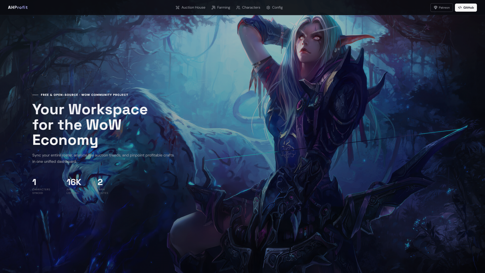
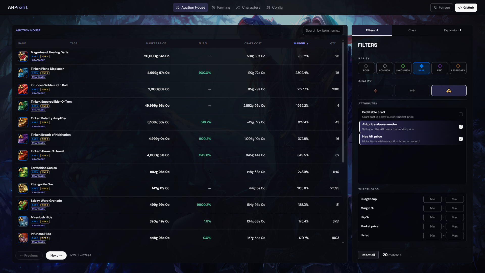
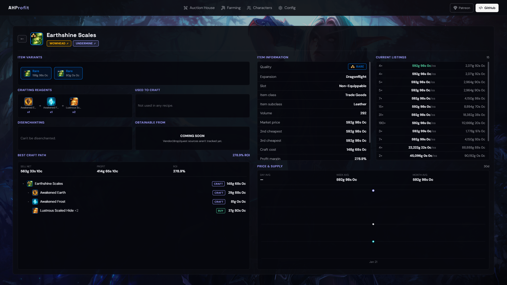
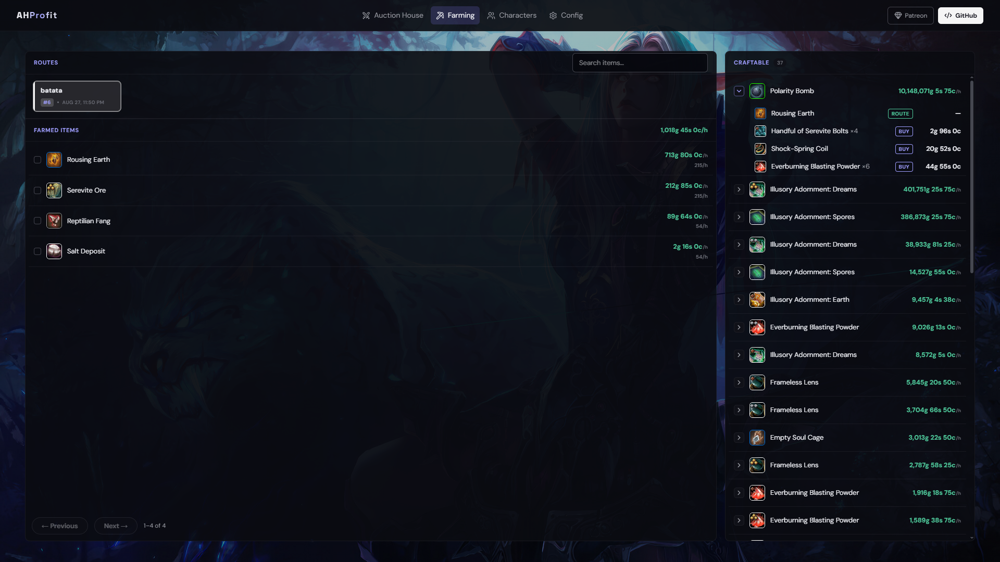
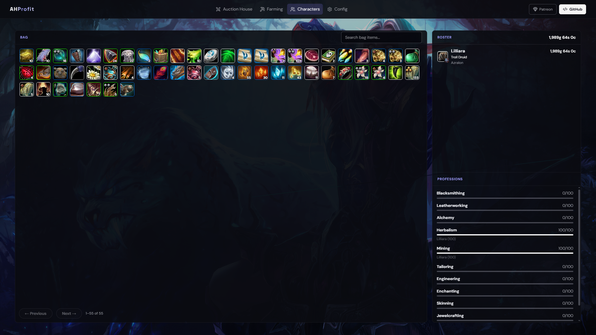
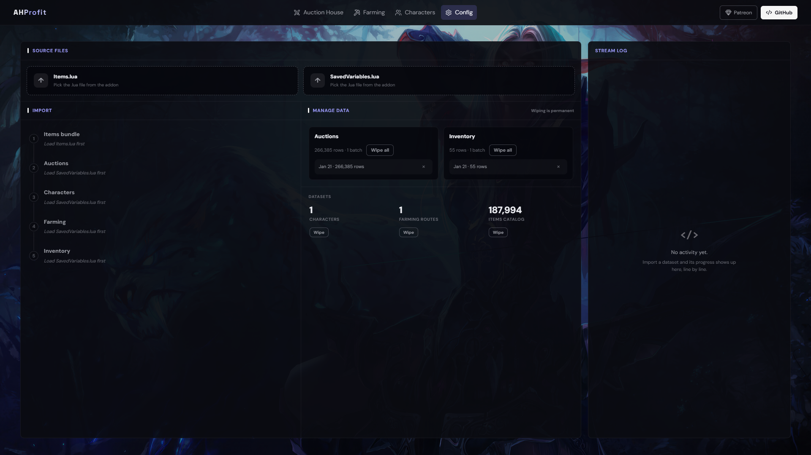

# AHProfit

A two-week project that collects data from World of Warcraft (auction house, player inventory and farming routes) and cross-references it with data on every item in the game obtained via scraping. The goal is to generate accurate market analysis to find the best opportunities for profit selling items.

<p align="center">
  
  
  
</p>
<p align="center">
  
  
  
</p>

## Project structure

- `api-hono/` — API built with Hono + SQLite (kysely)
- `web-react/` — frontend built with React + Vite + Tailwind
- `desktop-webview/` — web view used for packaging the desktop app

## Develop

You need [Bun](https://bun.sh).

```
bun install
bun run dev
```

This starts the API and the frontend together. The frontend runs at
`http://localhost:5173` and the API at `http://localhost:3000`.

## Desktop

```
cd desktop-webview
bun run build:win-x64
```

Replace `win-x64` with `linux-x64`, `linux-arm64`, `darwin-x64` or `darwin-arm64`
depending on your system. The executable is written to `desktop-webview/build/`.

## License

This project is licensed under the GNU Affero General Public License v3.0.
You are free to use, modify and share it, but any derivative work must also
be released as open source under the AGPL-3.0, keeping the original
authorship notices. This also applies when the software is run as a network
service: users interacting with it over a network must be able to get the
corresponding source. See the LICENSE file for the full text.